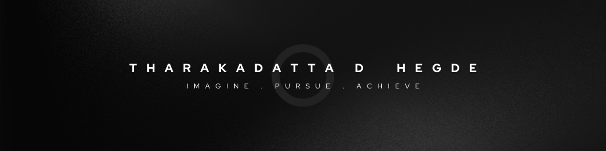

<h1 align="center">Hi There👋, I'm Tharakadatta Hegde</h1>
<h3 align="center">Constantly Learning and Evolving in Tech!</h3>

## 🙋‍♂️ About Me
- 👨🏼‍🎓 Pre Final Year Computer Science student from IIT Jodhpur.
- 🌱 Software Development Intern at GlutaClass in Summers 2024
- ✨ Had Participated in INTER-IIT Tech 12.0 in the Adobe Problem Statement. 
- 👯 I’m on the path to learn and collaborate on open source projects.
- 📫 How to reach me: <a href="mailto:B22CS102@iitj.ac.in">B22CS102@iitj.ac.in</a> 
- Visit My Portfolio <a href="https://portfolio-tharak.vercel.app/"> Portfolio Website </a>

<h3 align="left">Connect with me:</h3>

## 🚀 Languages and Tools

  
  
  
  
 
  

 

 

